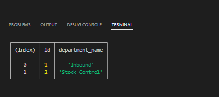
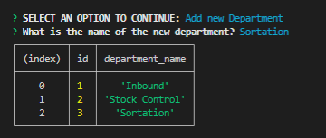
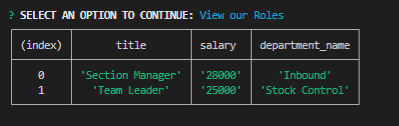
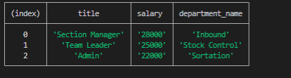
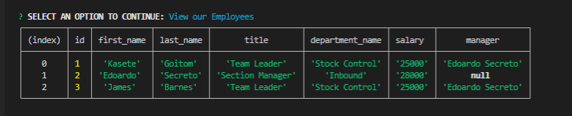
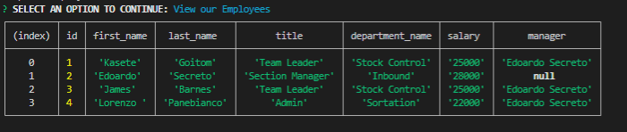
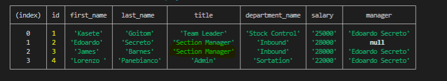

# Employ-Tracker-W12

## Description
The application allows the user to view, add and update the Employee records.


## Table of Contents
- [User-Story](#user-story)
- [Usage](#usage)
- [Installation](#Installation)
- [Screenshots-of-Deployment](#screenshots-of-Deployment)
- [Walkthrough-Video-Link](#walkthrough-Video-Link)
- [Future-Developments](#Future-Developments)
- [URL-of-GitHub-Repository](#URL-of-GitHub-Repository)


## User-Story

```md
AS A business owner
I WANT to be able to view and manage the departments, roles, and employees in my company
SO THAT I can organize and plan my business
```

## Usage

```md
GIVEN a command-line application that accepts user input
WHEN I start the application
THEN I am presented with the following options: view all departments, view all roles, view all employees, add a department, add a role, add an employee, and update an employee role
WHEN I choose to view all departments
THEN I am presented with a formatted table showing department names and department ids
WHEN I choose to view all roles
THEN I am presented with the job title, role id, the department that role belongs to, and the salary for that role
WHEN I choose to view all employees
THEN I am presented with a formatted table showing employee data, including employee ids, first names, last names, job titles, departments, salaries, and managers that the employees report to
WHEN I choose to add a department
THEN I am prompted to enter the name of the department and that department is added to the database
WHEN I choose to add a role
THEN I am prompted to enter the name, salary, and department for the role and that role is added to the database
WHEN I choose to add an employee
THEN I am prompted to enter the employee’s first name, last name, role, and manager, and that employee is added to the database
WHEN I choose to update an employee role
THEN I am prompted to select an employee to update and their new role and this information is updated in the database 
```

## Installation
- mysql
- node.js

## Screenshots-of-Deployment
### SQL Structure
;

### Departments
#### Departments at early stage
;
#### Added Department
;

### Roles
#### Roles at early stage
;
#### Added Role
;

### View Employee
#### Employee at early stage
;
#### Added Employee
;
#### Updated Employee
;


## Walkthrough-Video-Link
https://youtu.be/SdDhyjedPtY

## Future-Developments
To make all tables displayed in the terminal after user selects add new employee, add new newrole and update employee and fills their fields.

## URL-of-GitHub-Repository
https://github.com/mattesanna017/Employ-Tracker-W12